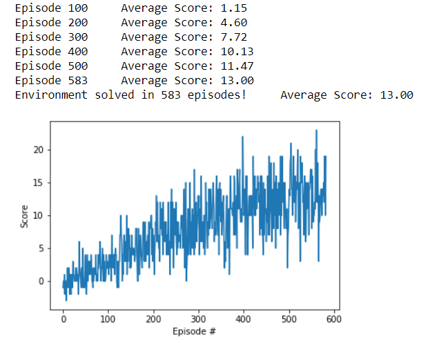

## Learning Algorithm

The learning algorithm used to train the agent was a Deep Q-Network model trained with a temporal-difference algorithm using experience replay and fixed q-targets.

#### The Model Architecture for the Q-Network:

- Inputs = State Space Size (37)
- Hidden Linear Layer 1 (64 nodes)
- Hidden Linear Layer 2 (64 nodes)
- Outputs = Action Space Size (4)

#### The Hyperparameters:

- minibatch size: 64
- replay memory size: 100000
- update frequency: 4
- discount factor (gamma): 0.99
- tau: 0.001
- optimizer: Adam
- learning rate: 0.0005
- eps_start: 1.0
- eps_decay: 0.995
- eps_end: 0.01

## Plot of Rewards

Here we see a plot of rewards per training episode to illustrate that the agent is able to receive an average reward (over 100 episodes) of at least +13. The environment was solved in 583 episodes.

## Ideas for Future Work

There are many ways that this agent could be improved in the future. I will list a few ideas here that could be tested.

1. Experiment more with the model hyperparameters.
2. Use LSTM layers in the model architecture.
3. Use a Double DQN. 
4. Use Dueling DQN. 
5. Use Prioritized experience replay.
