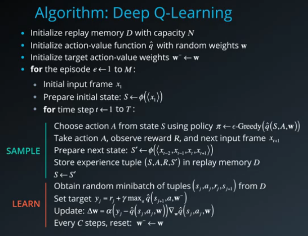

## Learning Algorithm

The learning algorithm used to train the agent was Deep Q-Learning.

Deep Q-Learning attempts to find and represent the optimal action-value function as a neural network (Q-Network). 

Deep Q-Learning is enhanced by using two main concepts which are experience replay and fixed q-targets.

#### Experience Replay 

When the agent interacts with the environment, the sequence of experience tuples can be highly correlated. The naive Q-learning algorithm that learns from each of these experience tuples in sequential order runs the risk of getting swayed by the effects of this correlation. By instead keeping track of a replay buffer and using experience replay to sample from the buffer at random, we can prevent action values from oscillating or diverging catastrophically.

The replay buffer contains a collection of experience tuples (S, A, R, S′). The tuples are gradually added to the buffer as we are interacting with the environment.

The act of sampling a small batch of tuples from the replay buffer in order to learn is known as experience replay. In addition to breaking harmful correlations, experience replay allows us to learn more from individual tuples multiple times, recall rare occurrences, and in general make better use of our experience.

#### Fixed Q-Targets

Two networks are used, with the “target” network merely being a copy of the training network. The training network will have its Q-values updated, but will use the Q-value of the target network when estimating future discounted return (i.e., it will use the “old” network to generate estimates). The target network will periodically be updated to match the training network, so that these estimates won’t be far away from the training network. Decoupling the target from the parameters makes the learning algorithm much more stable and less likely to diverge or fall into oscillations.

The pseudo-code for the DQN algorithm is as follows:

## The Model Architecture for the Q-Network

- Inputs = State Space Size (37)
- Hidden Linear Layer 1 (inputs = 37, outputs = 64)
- Relu Activation
- Hidden Linear Layer 2 (inputs = 64, outputs = 64)
- Relu Activation
- Hidden Linear Layer 3 (inputs = 64, outputs = 4)
- Outputs = Action Space Size (4)

## The Hyperparameters

- BUFFER_SIZE = int(1e5)  # replay buffer size
- BATCH_SIZE = 64         # minibatch size
- GAMMA = 0.99            # discount factor
- TAU = 1e-3              # for soft update of target parameters
- LR = 5e-4               # learning rate
- UPDATE_EVERY = 4        # how often to update the network
- OPTIMIZER: Adam
- EPS_START: 1.0          # epsilon start, decay and end define the exploration properties
- EPS_DECAY: 0.995
- EPS_END: 0.01

## Plot of Rewards

Here we see a plot of rewards per training episode to illustrate that the agent is able to receive an average reward (over 100 episodes) of at least +13. The environment was solved in 583 episodes.

## Ideas for Future Work

There are many ways that this agent could be improved in the future. I will list a few ideas here that could be tested.

1. Experiment more with the model hyperparameters.
2. Use LSTM layers in the model architecture.
3. Use a Double DQN. 
4. Use Dueling DQN. 
5. Use Prioritized experience replay.

## References

- [Human-level control through deep reinforcement learning](https://storage.googleapis.com/deepmind-media/dqn/DQNNaturePaper.pdf)
