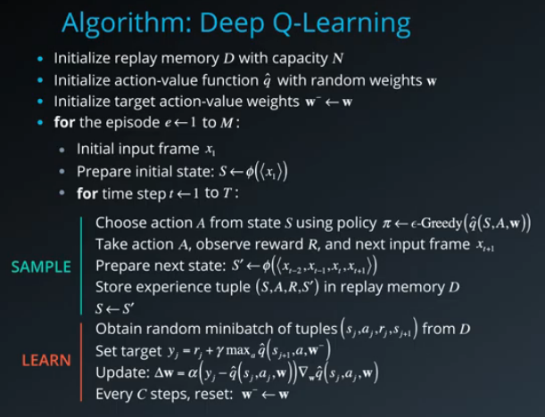

## Learning Algorithm

The learning algorithm used to train the agent was a Deep Q-Network model trained using experience replay and fixed q-targets.

Fixed Q-Targets: Two networks are used, with the “target” network merely being a copy of the training network. The training network will have its Q-values updated, but will use the Q-value of the target network when estimating future discounted return (i.e., it will use the “old” network to generate estimates). The target network will periodically be updated to match the training network, so that these estimates won’t be far away from the training network. Decoupling the target from the parameters makes the learning algorithm much more stable and less likely to diverge or fall into oscillations.

The pseudo-code for the DQN algorithm is as follows:

## The Model Architecture for the Q-Network:

- Inputs = State Space Size (37)
- Hidden Linear Layer 1 (inputs = 37, outputs = 64)
- Relu Activation
- Hidden Linear Layer 2 (inputs = 64, outputs = 64)
- Relu Activation
- Hidden Linear Layer 3 (inputs = 64, outputs = 4)
- Outputs = Action Space Size (4)

## The Hyperparameters:

- minibatch size: 64
- replay memory size: 100000
- update frequency: 4
- discount factor (gamma): 0.99
- tau: 0.001
- optimizer: Adam
- learning rate: 0.0005
- eps_start: 1.0
- eps_decay: 0.995
- eps_end: 0.01

## Plot of Rewards

Here we see a plot of rewards per training episode to illustrate that the agent is able to receive an average reward (over 100 episodes) of at least +13. The environment was solved in 583 episodes.

## Ideas for Future Work

There are many ways that this agent could be improved in the future. I will list a few ideas here that could be tested.

1. Experiment more with the model hyperparameters.
2. Use LSTM layers in the model architecture.
3. Use a Double DQN. 
4. Use Dueling DQN. 
5. Use Prioritized experience replay.

## References

- [Human-level control through deep reinforcement learning](https://storage.googleapis.com/deepmind-media/dqn/DQNNaturePaper.pdf)
